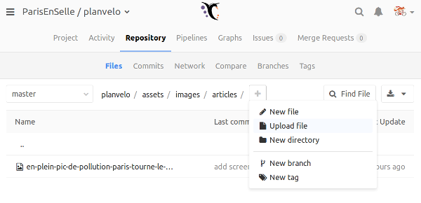

# Site de l'observatoire du Plan Vélo de Nantes Métropole

Ce projet contient le code du site web de l'observatoire du Plan Vélo de Nantes Métropole 2020-2026.

### Sommaire
<!-- TOC depthFrom:2 depthTo:6 withLinks:1 updateOnSave:1 orderedList:0 -->

- [Contribuer](#contribuer)
	- [Contribuer au contenu](#contribuer-au-contenu)
		- [Ajouter une image](#ajouter-une-image)
		- [Ajouter un article](#ajouter-un-article)
			- [Écrire un article](#ecrire-un-article)
			- [Ajouter un article de presse](#ajouter-un-article-de-presse)
		- [Modifier une page](#modifier-une-page)
	- [Contribuer au code](#contribuer-au-code)
		- [Tester en local](#tester-en-local)
- [Déploiement](#déploiement)

<!-- /TOC -->

[](https://framagit.org/ParisEnSelle/planvelo/commits/master)

## Contribuer

* Pour contribuer, il vous faut d'abord un compte `Framagit`. Rendez-vous ici pour le créer: https://framagit.org/users/sign_in
* Une fois connecté, vous pouvez demander un accès à ce projet via l'interface.

### Contribuer au contenu

Le langage de balisage choisi pour rédiger du contenu est le `Kramdown`. C'est une variante **très** proche du `Markdown`, plus populaire.

* Syntaxe: https://kramdown.gettalong.org/syntax.html

* Éditeur en ligne: https://kramdown.herokuapp.com/

#### Ajouter une image

* Préparer son image, au format `jpg` de préférence. La nommer en reprenant le titre de l'article, sans caractères spéciaux, ni accents. Par exemple pour un titre `Paris : le « Plan Vélo » prend l’eau`, on peut choisir `plan-velo-eau.jpg` auquel correspond l'article `2016-12-07-paris-velo-eau.markdown`.

* Se placer dans le répertoire cible: `planvelo/assets/images/articles` pour les articles, `planvelo/assets/images/pages` pour les pages.

* Ajouter votre fichier avec "Upload file".



* Mettre un texte pour décrire la modification. Par exemple: "ajout de paris-velo-eau.jpg".


* Cliquer sur "Upload file".

#### Ajouter un article

Il existe 2 catégories d'articles:
* "article": articles écrits par les membres de Paris En Selle
* "presse": articles de la presse, qui peuvent éventuellement contenir une revue de presse en plus du lien vers l'article.

Dans les 2 cas, il s'agit de créer un fichier dans le dossier `_post` de ce projet.

* Pour cela, se placer dans le répertoire `_post`, sélectionnez "New file".


* Renseignez le nom du fichier cible au format "AAAA-MM-JJ-titre-de-mon-article.markdown" (Date + titre + extension .markdown, le tout séparé de traits d'union `-`)
* Quand vous avez terminé, ajoutez une description à la modification que vous avez apportée grâce au champ "Commit message".


##### Écrire un article

Exemple:
```
---
layout: post
title:  "Mon premier article"
date:   2016-12-06 00:42:00 +0100
author: Pierre Dupont
categories: article
image: assets/images/articles/mon-premier-article.jpg
---

Bonjour, voici le contenu de mon premier article. Et voilà une image:

```

Vous pouvez reprendre cet exemple en changeant `title`, `date`, `author`, `image`, et bien sûr le contenu.

L'image est facultative mais toujours bienvenue. Dans cet exemple, elle est reprise dans le contenu: `{{ page.image | relative_url }}`.

Même si vous n'utilisez pas l'image dans le contenu de votre post, elle apparaît dans les réseaux sociaux quand vous partagez l'article. À noter que si aucune image n'est indiquée dans l'entête, c'est le logo de Paris En Selle qui est utilisé.

##### Ajouter un article de presse

Exemple:
```
---
layout: post
title:  "Paris : le « Plan Vélo » prend l’eau"
date:   2016-12-07 00:42:00 +0100
categories: presse
author: Olivier Razemon, Le Monde
link: http://transports.blog.lemonde.fr/2016/12/07/paris-velo-eau/
image: assets/images/articles/paris-velo-eau.jpg
---

[]({{ page.link }}){:rel='nofollow'}

Lire cet [article]({{ page.link }}){:rel='nofollow'}.
```

Le contenu de cet article est composé d'une image (capture d'écran dont le lien pointe sur l'article) et d'un texte avec un lien vers l'article.

Vous pouvez reprendre cet exemple en changeant uniquement les éléments suivants dans l'entête: `title`, `date`, `author` et `image`.

#### Modifier une page

* Les pages sont présentes à la racine du projet:
```
a-propos.md
engagements.md
...
```

* Cliquez sur "edit" après avoir cliqué sur une des pages que vous souhaitez modifier.


* Quand vous avez terminé, ajoutez une description à la modification que vous avez apportée dans le champ "Commit message".

### Contribuer au code

* La doc de `Jekyll`: https://jekyllrb.com/docs/home/ #RTFM

* Le moteur de template utilisé par `Jekyll` est `Liquid`: https://shopify.github.io/liquid/

#### Tester en local

```bash
gem install bundler
bundle install
bundle exec jekyll serve --incremental # ou, jekyll serve --incremental
firefox localhost:4000
```

Autre méthode, avec `docker` en prérequis:
```bash
docker build -t planvelo .
docker run -p 127.0.0.1:4000:4000 -v $PWD:/srv -ti planvelo
firefox localhost:4000
```

## Déploiement

Ce site web utilise `jekyll`. Ce logiciel fonctionne sans base de données et transforme le code présent en pages HTML.

Chaque modification donne lieu à la regénération complète des pages. Les modifications peuvent être visibles moins d'une minute après, sur le site de test: https://test.planvelo.paris.

Le déploiement sur le site de production nécessite, quant à lui, une intervention manuelle dans l'écran "Pipeline > Builds". Bouton "Play".


Dans l'écran "Pipeline > Environments", vous pouvez voir le niveau de modification de chaque environnement dans la colonne "Commit".


